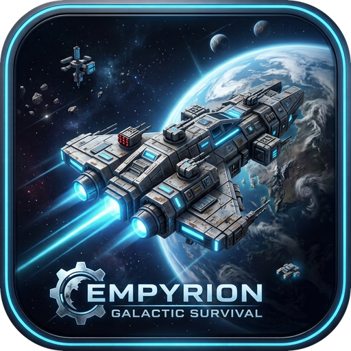

# Empyrion Scenario Editor

<p align="center">
  
</p>

[](https://github.com/Daflo-Empyrion/Scenario-Editor/releases/latest)
[](https://www.gnu.org/licenses/gpl-3.0.html)
[](https://github.com/Daflo-Empyrion/Scenario-Editor/releases/latest)

Editeur graphique (PyQt6) pour la creation et la modification de scenarios
**Empyrion Galactic Survival** : blocs et objets (ECF), recettes, playfields,
missions PDA, economie des marchands, arbres technologiques, dialogues et
localisation — avec une suite de traduction complete (IA locale ou en ligne),
des verifications de coherence et un systeme de securite qui preserve tes
scenarios d'origine. Voir `wiki_app_fr.md` (ou `wiki_app_en.md`, accessibles
aussi depuis le menu Aide de l'application) pour la documentation complete.

## Fonctionnalites

### Edition ECF (blocs et objets)
- Arbre de navigation par blocs, recherche, filtrage par propriete, **fiche
  d'info detaillee** par item (descriptif, fabrication, deblocage, export
  Markdown) avec edition inline
- Mode tableau automatique pour les structures repetitives (Child Items,
  LootGroups...)
- **Creation guidee de bloc/item** : choix Id+Name ou Name seul, proprietes
  issues du fichier lui-meme (valeurs suggerees en liste deroulante),
  proposition automatique du Template (recette de craft) associe
- **Selecteur d'items par catalogue** sur toutes les cles qui referencent un
  item (conteneurs, loot, recettes, marchands...) — catalogue quasi
  instantane, dedoublonne scenario > vanille
- **Transformation en masse** : multiplier/ajouter/fixer/plafonner/arrondir
  une propriete sur plusieurs blocs a la fois, avec revue editable
- Duplication avec reecriture automatique des references internes
- Fusion intelligente entre scenarios, avec apercu modifiable et garde-fou
  anti-collision
- Comparaison de scenarios A/B, fichiers modifies en un coup d'oeil

### Missions PDA
- Editeur complet : chapitres, taches, actions, recompenses, activations
- Assistant de creation de mission en 3 etapes
- **Validation du PDA** basee sur le guide officiel, calibree sur le contenu
  reel (vanille, Reforged Eden 2, Atlantis) : erreurs et avertissements
  navigables par double-clic

### Traduction (le gros morceau)
- **Moteurs multiples au choix** :
  - **NLLB (IA, Meta)** — 100 % local, aucun texte ne quitte le poste,
    variantes 600M / 1.3B installables depuis l'application
  - **Argos** — 100 % local, leger, installe en un clic
  - **Groq (IA en ligne)** — tier gratuit permanent, compte et cle crees en
    3 clics via l'assistant, compteur de quota en direct
  - **Google Translate** — sans cle API
- **Traductions officielles du jeu en vert** : les textes identiques a la
  localisation Eleon (Localization.csv, PDA.csv, Dialogues.csv de la
  vanille) sont traduits avec les textes officiels et marques visuellement
- **Memoires de traduction** : ce que tu valides est retenu (jamais deux
  fois le meme travail) ; memoire officielle consultee en repli
- **Glossaire terminologique** : impose tes traductions d'acronymes et de
  noms propres, auto-alimente par les cellules courtes validees
- **Revisions interruptibles** : controler 5 000 lignes se fait en plusieurs
  fois — quitte la revue a tout moment, tout est sauvegarde et propose a la
  reprise
- **Correcteur orthographe/grammaire Grammalecte** integre (cellule,
  colonne ou fichier entier)
- **Protection des structures** : balises BBCode, placeholders
  ({PlayerName}...), nombres et termes du glossaire ne sont jamais deformes
  par les moteurs
- Confidentialite maitrisee : les moteurs locaux n'envoient rien du tout ;
  la traduction en ligne est desactivable d'une case (voir `PRIVACY.md`)

### Playfields et galaxie (YAML)
- Editeur structure a 8 onglets (ressources, POI, creatures, drones,
  zones de spawn, effets...) au lieu du texte brut
- **Carte 2D** : POI deplacables a la souris, points de depart, patrouilles,
  zoom et filtres
- **Inspecteur de POI** : statistiques de drones par POI et par faction
- **Carte de la galaxie** (Sectors.yaml) : systemes solaires editables,
  curseur d'inclinaison pour separer les systemes proches en X/Z

### Economie des marchands
- Editeur dedie : prix, stocks, taux de rachat, par station et par faction
- Verification de coherence integree (menu Verification)

### Verifications
- Referencess, references croisees entre fichiers, blocs en attente (conflits
  d'Id), economie, jetons orphelins, validation PDA
- **Centre de verification (F5)** : tout d'un coup, avec compteurs

### Securite
- Travail sur **copie de travail** : tes scenarios d'origine restent intacts
- Fichier non modifie reecrit **a l'identique octet par octet** (BOM et fins
  de ligne preserves)
- Sauvegardes versionnees avant mise a jour, restauration avec backup de
  securite, enregistrement atomique, recuperation apres plantage,
  annulation globale

### Et aussi
- 13 themes visuels dont les themes Relief (nuit et clair), interface
  Fluent optionnelle
- Tutoriels integres pas-a-pas et wikis bilingues FR/EN consultables dans
  l'application
- Protocole de test manuel integre (260 cas FR/EN, commandes copiables)
- Bouton "Signaler" (rapport de bug pre-rempli vers GitHub Issues)
- Verification automatique de nouvelle version au demarrage
- Outils en ligne de commande (`EmpyrionEditorCLI.exe`) pour les memes
  operations en scripts

## Installation

1. **Installeur Windows** (recommande) : telecharge
   `Setup-EmpyrionScenarioEditor-vX.X.X.exe` depuis la page
   [Releases](https://github.com/Daflo-Empyrion/Scenario-Editor/releases/latest)
   — installeur autonome, aucune dependance ni Python requis
2. **Depuis les sources** (pour developper) :
   ```bash
   python -m venv venv
   venv\Scripts\activate      # Windows
   pip install -r requirements.txt
   python run_gui.py
   ```

Fonctionne avec la vanille et les scenarios personnalises (Reforged Eden 2,
Atlantis...).

## Construire l'installeur

Voir [`BUILD.md`](BUILD.md) : PyInstaller + Inno Setup en local, ou
construction automatisee par GitHub Actions a chaque tag pousse.

## A propos des avertissements antivirus

Windows SmartScreen ou ton antivirus peuvent signaler l'installeur au
premier lancement — faux positif connu, courant sur les executables Python
non signes numeriquement. Le code source est integralement disponible dans
ce depot (voir `BUILD.md` pour le detail).

## Politique de signature de code / Code Signing Policy

Signature de code gratuite fournie par SignPath.io, certificat de la
Fondation SignPath (candidature en cours).
*Free code signing provided by SignPath.io, certificate by SignPath
Foundation (application pending).*

- **Committers, reviewers et approvers** : [Daflo](https://github.com/Daflo-Empyrion)
  (mainteneur unique de ce projet a ce jour)
- **Politique de confidentialite / Privacy policy** : voir [`PRIVACY.md`](PRIVACY.md)
  pour le detail exact de ce qui est envoye sur le reseau, quand, et comment
  le desactiver. En resume : tout est local, sauf la traduction en ligne que
  tu choisis explicitement d'activer.

## Signaler un bug ou proposer une amelioration

Le bouton "Signaler" integre a l'application (barre d'outils superieure)
ouvre un formulaire pre-rempli vers les
[Issues GitHub](https://github.com/Daflo-Empyrion/Scenario-Editor/issues) —
ou depose-en une directement.

## Licence

Ce projet est distribue sous licence **GNU General Public License v3.0**
(GPLv3) — voir le fichier [`LICENSE`](LICENSE) pour le texte complet.

En resume : tu es libre d'utiliser, etudier, modifier et redistribuer ce
logiciel, a condition que toute version modifiee ou derivee reste elle
aussi sous licence GPLv3, avec le code source disponible. Plus d'informations
sur [gnu.org/licenses](https://www.gnu.org/licenses/gpl-3.0.html).

Copyright (C) 2026 Daflo
